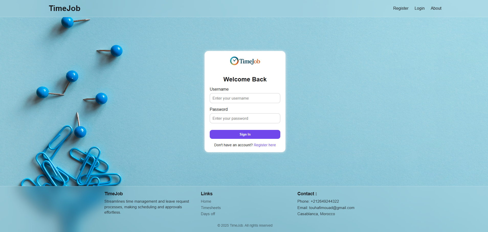
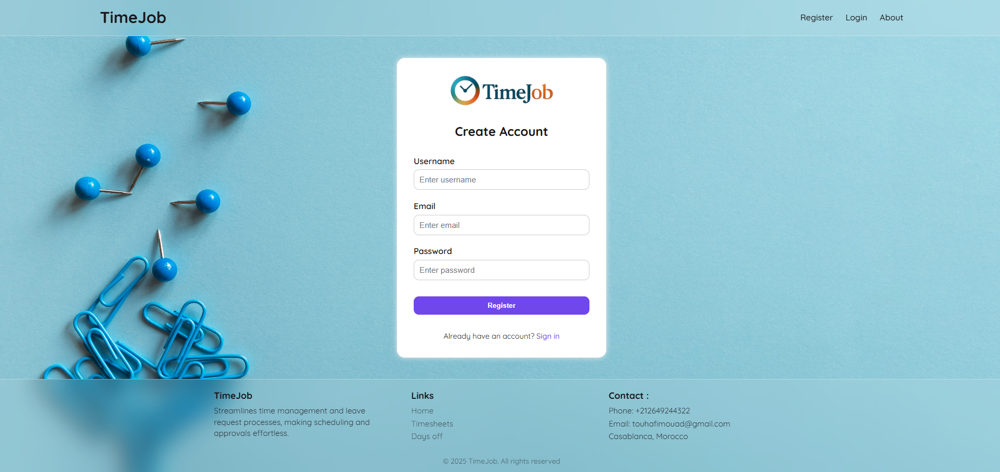
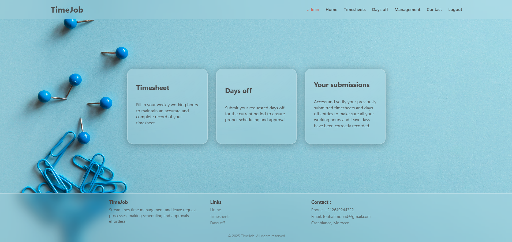
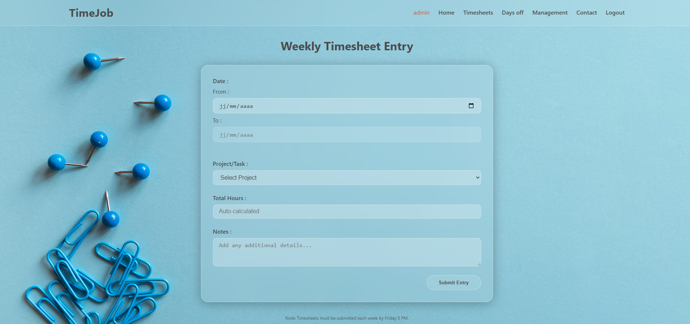
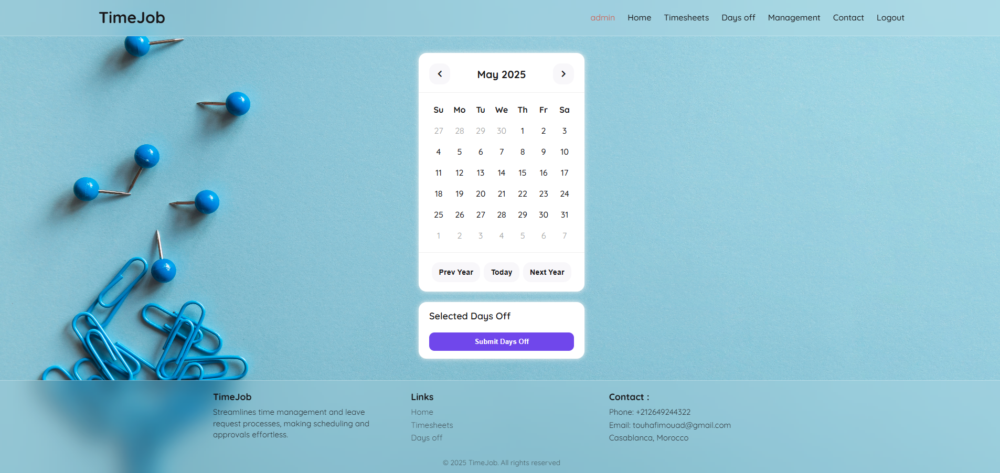
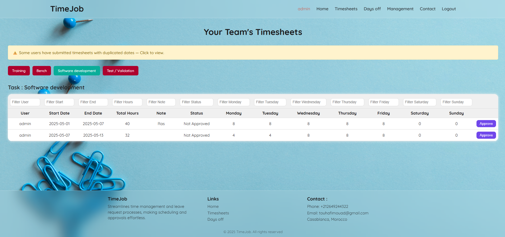
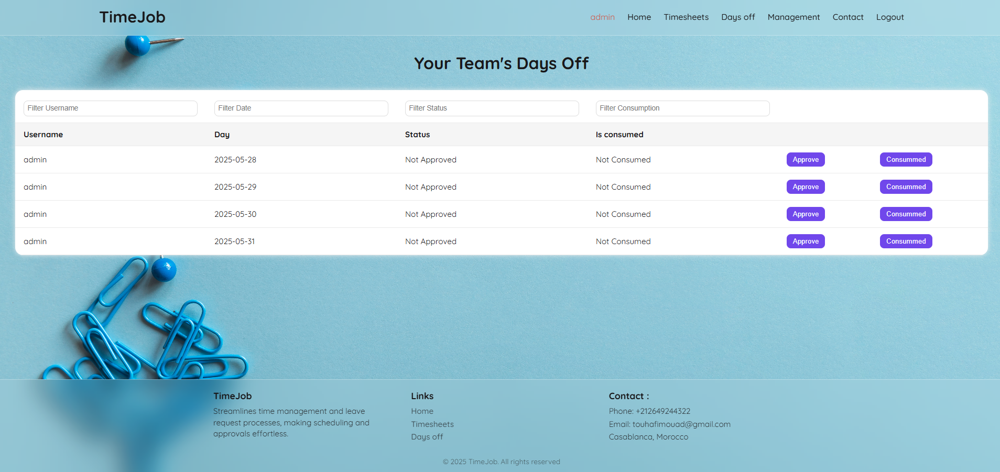
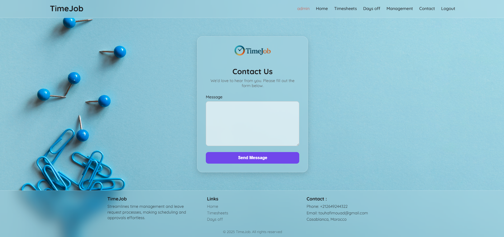

# 🛡️ TimeJob - Team Management Platform

TimeJob is a web application built with **Spring Boot**, using **JWT authentication**, allowing users and admins to manage **timesheets**, **leave requests**, and **internal messages** efficiently and securely.


---

## 🚀 Features

- ✅ JWT-based authentication (login with role detection)
- 👨‍💼 Role-based access: Admin vs. User
- 📅 Timesheet submission, approval, and update
- 📆 Days off tracking and approval system
- 💬 Contact form and admin-managed messages
- 🧩 Custom error pages (404, 403, 401)
- 🔐 Secure endpoints with Spring Security
- 🌐 Responsive UI with Thymeleaf + CSS (glassmorphism style)

---

## 📸 Screenshots of main pages

### 🔐 Login Page


### 🔐 Register Page


### 🗓️ Home Page


### 🗓️ Submit Timesheets Form (User)


### 🗓️ Submit Days-off Form (User)


### 🗓️ Submitted Timesheets (Admin)


### 🗓️ Submitted Days-off (Admin)


### 📬 Contact page


---

## 🧠 Tech Stack

| Layer         | Tech                       |
|---------------|----------------------------|
| Backend       | Spring Boot, Spring Security, JWT |
| Frontend      | Thymeleaf, CSS, JavaScript |
| Database      | H2 (in-memory)             |
| Build Tool    | Maven                      |

---

## ⚙️ Getting Started

### 🔧 Prerequisites

- Java 17+
- Maven 3+
- (Optional) Git

### 📥 Clone and Run

```bash
git clone https://github.com/mouadtouhafi/timejob.git
cd timejob
mvn spring-boot:run
